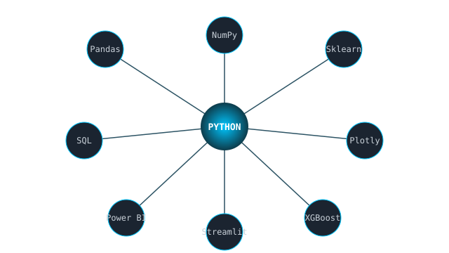

<div align="center">


<a href="https://git.io/typing-svg">
  
</a>

<br/>

<a href="https://git.io/typing-svg">
  
</a>

<br/>


</div>

---

## 🧬 About Me

- 🎓 Undergraduate in **Data Science & Business Analytics** at **General Sir John Kotelawala Defence University**, Sri Lanka
- 🔭 Currently building data systems, ML models and analytics dashboards
- 🌱 Learning across the full data stack — engineering, modelling, and BI
- 💡 Interested in turning messy real-world data into decisions people can act on
- 📫 Reach me through the links at the bottom of this page

---

## ⚡ Live Development Pulse

<!--LIVE_PULSE_START-->
| | |
|---|---|
| 📦 **Public repositories** | 8 |
| 🕓 **Last push** | 4h ago |
| 🔤 **Most used language** | Python |
| 🔄 **Last synced** | 2026-09-02 07:39 UTC |
<!--LIVE_PULSE_END-->

> This table and the Digital DNA chart below are regenerated automatically once a day by `.github/workflows/update-readme.yml` — real numbers pulled live from the GitHub API, not hand-typed.

---

## 🧬 Digital DNA

<div align="center">

</div>

<sub>Weighted automatically from the languages actually used across your repositories — the more you build in something, the taller the bar.</sub>

---

## 🌐 Tech Constellation

<div align="center">

</div>

---

## 🧪 Project Intelligence

<details open>
<summary><b>⚽ Premier League Analytics Pro</b> — Sports Analytics</summary>
<br/>

| | |
|---|---|
| **Problem** | *(fill in — e.g. predicting match outcomes from historical data)* |
| **Data** | *(fill in — e.g. 9,880 matches)* |
| **Technologies** | Python · Pandas · Plotly · Scikit-learn · XGBoost · LightGBM · Streamlit |
| **Status** | 🟢 Active development |

</details>

<details>
<summary><b>🫀 CardioVision AI</b> — Healthcare / ML</summary>
<br/>

| | |
|---|---|
| **Problem** | *(fill in)* |
| **Data** | *(fill in)* |
| **Technologies** | *(fill in)* |
| **Status** | *(fill in)* |

</details>

<details>
<summary><b>👗 Fashion Retail Analytics</b> — Retail / BI</summary>
<br/>

| | |
|---|---|
| **Problem** | *(fill in)* |
| **Data** | *(fill in)* |
| **Technologies** | *(fill in)* |
| **Status** | *(fill in)* |

</details>

<details>
<summary><b>🏥 Hospital Data System</b> — Data Engineering</summary>
<br/>

| | |
|---|---|
| **Problem** | *(fill in)* |
| **Data** | *(fill in)* |
| **Technologies** | *(fill in)* |
| **Status** | *(fill in)* |

</details>

<sub>Fill in each table with your real project details — that's what makes this section worth more than a plain project list to a recruiter skimming your profile.</sub>

---

## 🧫 Experiment Lab

<details>
<summary><b>EXP-001 — Premier League Match Prediction</b></summary>
<br/>

**Hypothesis:** Can historical match data predict future outcomes?
**Status:** 🧪 Experimenting
**Pipeline:** Dataset → EDA → Feature Engineering → Models → Evaluation → Result

</details>

---

## 📊 GitHub Analytics

<div align="center">


<br/>


<br/>


</div>

---

## 🏆 Trophies

<div align="center">

</div>

---

## 🐍 Contribution Matrix

<div align="center">

</div>

---

## 🛰️ Data Journey

```text
2024 ── Programming fundamentals
2025 ── Data Analytics, SQL, Databases
2026 ── Machine Learning, Data Engineering, Advanced Analytics
2027 ── AI + Intelligent Systems  (target)
```

---

## 🌍 Connect

<div align="center">

<a href="https://www.linkedin.com/in/YOUR-LINKEDIN-ID" target="_blank"></a>
<a href="mailto:YOUR-EMAIL@example.com"></a>
<a href="https://twitter.com/YOUR-TWITTER-ID" target="_blank"></a>
<a href="https://medium.com/@YOUR-MEDIUM-ID" target="_blank"></a>

</div>

<br/>

<div align="center">

</div>
